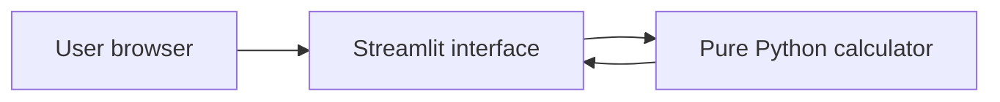

# MedSync2 Application Design

Status: implemented non-production baseline

## Purpose

MedSync2 is a small, calculation-only Streamlit application that estimates additional medication units required between a calculation date and an aligned refill date.

It is not a prescribing system, medication-ordering system, pharmacy interface, electronic health record, or clinical decision-support engine.

## Architecture



- `med_sync_app.py` owns presentation, user guidance, and error display.
- `medsync/calculator.py` owns validation and deterministic calculations.
- The calculation module has no Streamlit, network, database, or filesystem dependency.

## Calculation contract

Coverage days count calendar dates whose doses must be supplied by the entered on-hand or bridge quantity.

- The calculation-date dose is included only when `include_start_date` is true.
- The aligned-refill-date dose is included only when `include_aligned_refill_date` is true.
- Dates strictly between the two endpoints are always counted.
- If the endpoints are the same date, that calendar date is counted once when either flag is true.

For each medication:

```text
target units = coverage days * daily dose
additional units = max(target units - units remaining, 0)
```

Direct unit arithmetic prevents the overestimation produced by flooring `units_remaining / daily_dose` to whole days and then multiplying back to units.

## Supported inputs

- one to ten unique medication labels in the current UI;
- positive daily doses in hundredth-unit increments in the current UI;
- nonnegative remaining quantities in hundredth-unit increments;
- a calculation date and aligned refill date;
- explicit inclusion/exclusion for each endpoint dose.

The core module uses `Decimal` values so fractional quantities are calculated without binary floating-point drift.

## Explicit exclusions

The calculator does not model:

- variable schedules or alternating doses;
- tapers or titrations;
- as-needed use;
- missed doses or adherence;
- dose changes before the aligned refill date;
- package sizes, tablet splitting, liquid measurement, or pharmacy rounding;
- refill-too-soon rules, insurance limits, controlled-substance restrictions, or state/federal law;
- clinical appropriateness, interactions, contraindications, or medical advice.

## Data and trust boundary

The code intentionally has no persistence or analytics implementation. In a hosted deployment, values still travel from the browser to the Streamlit server and may be exposed by infrastructure, reverse-proxy, platform, or exception logs.

The default operating posture is therefore no patient identifiers and no production PHI until the controls in `SECURITY.md` and the cloud architecture decision records are completed.

## Reliability controls

- deterministic, date-only core logic;
- injectable calculation date for repeatable tests;
- explicit endpoint semantics;
- validation of date order, dose, quantity, label, uniqueness, type, and coverage horizon;
- unit, regression, UI, lint, type, security, dependency, and CodeQL checks in CI;
- non-root container execution and application health check.
