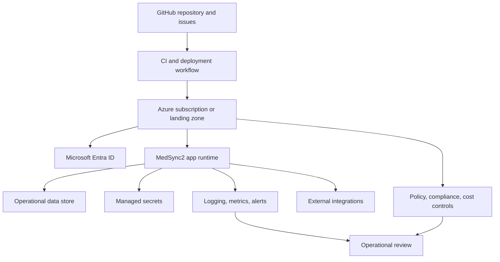

# Azure Essentials Operationalization for MedSync2

This document converts the Azure Essentials update research into a GitHub-operational implementation model for MedSync2.

> Interpretation note: the initiating request used `UDSE`. Until that acronym is defined in-repository, this package treats it as the operational-use layer for GitHub: source-boundary rules, coding-agent guidance, backlog work items, pull-request standards, and issue templates.

## Purpose

MedSync2 should use the Azure Essentials material as an execution framework, not as a marketing summary. The goal is to turn the research into a maintainable repository workflow that can guide future architecture, infrastructure, AI, security, compliance, and resiliency work.

## Source boundary

| Category | How to use it in MedSync2 | Required behavior |
|---|---|---|
| Source-derived Azure points | Use the Azure Essentials lifecycle and scenario structure as the adoption framework. | Label claims as source-derived when they come from the Azure Essentials kit or supplied research. |
| Current Microsoft documentation | Use for current names, portal paths, deployment models, compliance references, pricing mechanics, and implementation details. | Re-check current docs before making implementation commitments. |
| MedSync2-specific decisions | Apply only after reviewing actual product requirements, code, data flows, runtime, and compliance posture. | Document durable decisions in `docs/architecture/`. |
| General market analysis | Use only for neutral Azure-vs-AWS framing or executive tradeoff discussion. | Do not present as source-deck content or as a vendor claim. |

## Operating model

Azure Essentials should be operationalized through three repeating stages.

### 1. Readiness and foundation

MedSync2 work in this stage should answer:

- What Azure tenant, subscriptions, environments, and management groups will be used?
- What is the identity model through Microsoft Entra ID?
- Which secrets, keys, certificates, and app settings belong in Key Vault or equivalent managed secret storage?
- What baseline cost model is required before deployment?
- Which GitHub environments, branch rules, and deployment approvals protect production?
- What regulated-data assumptions exist, including PHI, PII, audit logs, and retention requirements?

Deliverables:

- Landing-zone decision record.
- Environment matrix for development, test, staging, and production.
- Secret-management policy.
- Initial cost-estimate record.
- GitHub environment-protection plan.

### 2. Design and govern

MedSync2 work in this stage should answer:

- What application architecture is being deployed?
- What data stores are authoritative?
- How are integrations authenticated and audited?
- Which policies govern resource creation, network exposure, data access, logging, and AI usage?
- How is compliance evidence collected without implying certification beyond verified scope?
- What threat model applies to patient, provider, synchronization, and integration data flows?

Deliverables:

- Architecture decision records.
- Data-flow diagrams.
- Threat-model notes.
- Policy-as-code backlog.
- Compliance evidence index.

### 3. Manage and optimize

MedSync2 work in this stage should answer:

- What are the service-level objectives, RTOs, and RPOs?
- Which alerts are required before production use?
- What dashboards show reliability, latency, error rates, synchronization failures, and cost?
- How are backup and restore tested?
- How are Well-Architected findings triaged?
- How are AI workloads evaluated for quality, safety, latency, and cost if Microsoft Foundry is used?

Deliverables:

- Observability baseline.
- Reliability review.
- Backup and restore test plan.
- Cost optimization review cadence.
- AI evaluation and safety runbook, if applicable.

## MedSync2 Azure reference path

This is a planning model, not an approved architecture.

## AI and agent architecture gate

Do not add AI-agent functionality merely because the Azure Essentials research discusses AI apps and agents. Add Microsoft Foundry only when a MedSync2 use case justifies it, such as:

- Clinical or administrative summarization with human review.
- Integration troubleshooting assistant.
- Patient or provider support workflow assistant.
- Internal operations copilot for synchronization failures.

Any AI addition must include:

- Use-case definition and excluded uses.
- Data classification and PHI/PII handling.
- Prompt and response logging policy.
- Content safety and prompt-protection plan.
- Evaluation metrics for groundedness, quality, latency, and cost.
- Model-deployment cost model, including standard pay-per-token versus provisioned throughput if traffic is predictable and production-scale.

## Required decision records

Create these before production cloud deployment decisions harden:

| Decision record | Trigger | Minimum content |
|---|---|---|
| `azure-landing-zone-decision-record.md` | First Azure environment decision | Tenant, subscription strategy, environments, management groups, region assumptions, owner. |
| `identity-and-access-decision-record.md` | First authentication or authorization decision | Microsoft Entra ID model, users, service principals, roles, break-glass assumptions. |
| `data-protection-decision-record.md` | First persistent data store or integration | Data classes, encryption, retention, access, backup, audit logs. |
| `observability-decision-record.md` | First deployment to shared or production-like environment | Logs, metrics, traces, alerts, dashboards, incident routing. |
| `ai-agent-decision-record.md` | Any AI or agent functionality | Foundry use case, model, safety controls, cost model, evaluation, human oversight. |

## Official resource index

Use these links as starting anchors. Verify freshness and region availability before committing implementation details.

- Microsoft Foundry: https://learn.microsoft.com/en-us/azure/foundry/what-is-foundry
- Foundry provisioned throughput: https://learn.microsoft.com/en-us/azure/foundry/openai/concepts/provisioned-throughput
- Azure landing zones: https://learn.microsoft.com/en-us/azure/cloud-adoption-framework/ready/landing-zone/
- Azure Well-Architected Framework: https://learn.microsoft.com/en-us/azure/well-architected/
- Azure compliance documentation: https://learn.microsoft.com/en-us/azure/compliance/
- Azure pricing calculator: https://azure.microsoft.com/en-us/pricing/calculator/
- Microsoft Entra ID rename guidance: https://learn.microsoft.com/en-us/entra/fundamentals/new-name
- Azure AI Content Safety: https://learn.microsoft.com/en-us/azure/ai-services/content-safety/overview
- Azure Monitor Baseline Alerts: https://azure.github.io/azure-monitor-baseline-alerts/
- Azure Verified Modules: https://azure.github.io/Azure-Verified-Modules/
- Azure Proactive Resiliency Library v2: https://azure.github.io/Azure-Proactive-Resiliency-Library-v2/

## Done means

A MedSync2 cloud-adoption task is not complete until:

- The source boundary is explicit.
- Current Microsoft docs were checked where product behavior, naming, pricing, portal paths, or compliance evidence are involved.
- Security, cost, reliability, and compliance assumptions are documented.
- Work is linked to a GitHub issue or backlog item.
- Any architecture change has a decision record.
- Any AI work has a safety, evaluation, logging, and cost plan.
